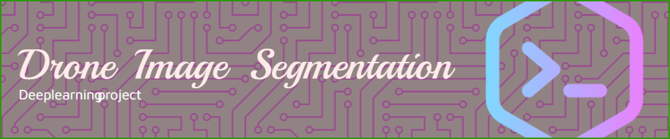
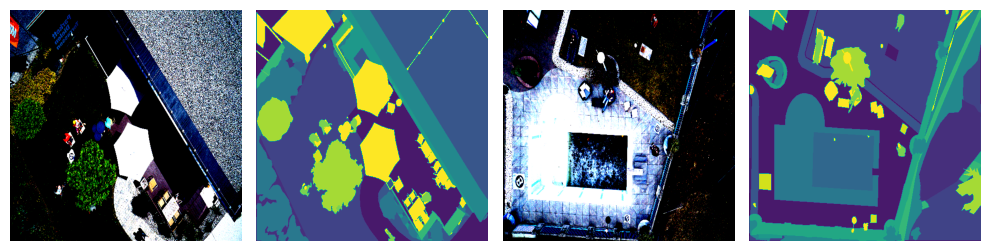

<p align="center">
This project still undrer development and will be updated soon. demo train is vailable in the notebook/trail.ipynb  file.

</p>

&nbsp;&nbsp;&nbsp;&nbsp;&nbsp;&nbsp;&nbsp;&nbsp;if you have any question please contact me at [email](mailto:amzad.rafi@northsouth.edu) or [linkedin](https://www.linkedin.com/in/amzad-rafi-0b0b0a1a0/)

# Drone Image Segmentation Project 
live demo avilable [here](http://ec2-3-15-40-216.us-east-2.compute.amazonaws.com:8080/)
## Project Overview

This is a PyTorch-based project for drone image segmentation. The goal of this project is to segment objects and regions of interest within aerial images captured by drones. Image segmentation is a crucial task in computer vision and has various applications, including agriculture, urban planning, and environmental monitoring.

## Data description 

This dataset is avilable in kaggle [here](https://www.kaggle.com/insaff/massachusetts-roads-dataset). The dataset contains 1100 images of size 1500x1500 pixels. Each image has a corresponding label image of the same size. The label image contains 22 classe. The following figure shows an example of an image and its corresponding label image.




## Pre requirments 
 
- Python 3.6 or higher 
- PyTorch 1.0 or higher [Please install this depanding on your machine](https://pytorch.org/get-started/locally/)
- Gpu and cuda 10.0 or higher [Please install this depanding on your machine](https://developer.nvidia.com/cuda-10.0-download-archive)

## How to install
 1. Clone the repository    
    ```bash
    $ git clone <clone link >
  

    ```

 2. Create a virtual environment and activate it using this command 
    ```bash
       $ conda create -n <env_name> python=<Python virsion>
    ```

1. Install the required packages 
    ```bash
        $ pip install -r requirements.txt
    ```


## Configurations modification 

The configurations are stored in the file `config.py`. You can modify the configurations as you want.
  1. Change all the paths in the `config.py` file to your own paths. 
  2. Change the batch size, number of epochs, and learning rate in the `config.py` file according to your machine specifications. 


## Model Architecture 

The model architecture is based on the [U-Net](https://arxiv.org/abs/1505.04597) architecture. The model is implemented in the `model.py` file. The model architecture is shown in the following figure.


## How to train 
Please confirm all the configurations in the `config.py` file before training.

1. Run the following command to train the model 
```bash
    $ cd src\DronVid\components
    $ python train.py 

```


## How to test 
if all the configaration is set properly you can run the following command to test the model 
```bash
    $ python test.py 
```

## Results 

1. The model was trained for 10 epochs with batch size of 4 and learning rate of 0.001.


## Deployment 

1. The model was deployed using flask and docker. 
2. The model was deployed on AWS EC2 instance. 
3. The model was deployed on AWS Sagemaker.


